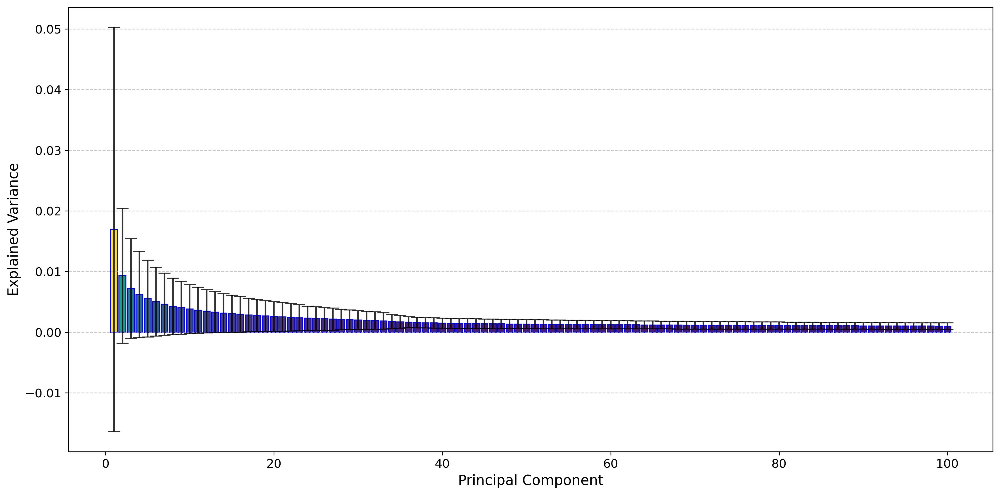

# Main Weight Analysis

This directory bundles the extra weight-space analysis we ran on top of the main experiment directories in this repo. It complements `CNN`, `VIT`, `GPT2`, and `LLaMA`; it does not replace them.

What lives here:

- extended alpha-metric analysis
- scree and cumulative summaries
- memory-threshold tables
- retained-layer summaries
- additional reconstruction notes and scripts

What does not change:

- the main experiment directories remain the canonical places for the core workflows
- this directory adds analysis on top of them rather than replacing them

## What Is In Here

- [`additional_R50`](./additional_R50/README.md): later 9-model ResNet-50 analysis with alpha filtering, scree plots, and low-rank recovery
- [`vit`](./vit/README.md): ViT extended analysis
- [`gpt2`](./gpt2/README.md): GPT-2 extended analysis
- [`llama`](./llama/README.md): LLaMA extended analysis
- [`flan_t5_glue`](./flan_t5_glue/README.md): Flan-T5 GLUE extended analysis

Supporting note: [analysis_readme.md](./analysis_readme.md)

## Code Notes

- `additional_R50` includes scripts for reconstruction, evaluation, and coefficient calibration.
- `vit`, `gpt2`, and `llama` combine released analysis artifacts with copies of the base download, PCA, and plotting scripts from `VIT/`, `GPT2/`, and `LLaMA/`.
- `flan_t5_glue` currently packages the validated recent-analysis artifacts without a duplicated script bundle.
- This means the directory is a convenient analysis bundle, not a verbatim mirror of the separate transformer analysis workspace.
- Coefficient fine-tuning is currently packaged here only for `additional_R50`.

## Cross-Model Snapshot

| Family | Models | Layers | `q_all` | `q_arch` | Retained layers | Savings @ `80%` | Savings @ `90%` | README |
| --- | --- | --- | --- | --- | --- | --- | --- | --- |
| `additional_R50` | `9` | `52` | `n/a` | `n/a` | `52` | `8.42%` | `5.23%` | [summary](./additional_R50/README.md) |
| `ViT` | `464` | `40` | `0.0518` | `0.3545` | `18` | `76.99%` | `62.62%` | [summary](./vit/README.md) |
| `GPT-2` | `177` | `49` | `0.0725` | `0.3059` | `23` | `64.73%` | `64.57%` | [summary](./gpt2/README.md) |
| `LLaMA` | `50` | `224` | `0.0940` | `0.3290` | `116` | `67.46%` | `67.13%` | [summary](./llama/README.md) |
| `Flan-T5 GLUE` | `196` | `216` | `0.0224` | `0.4850` | `179` | `90.59%` | `85.13%` | [summary](./flan_t5_glue/README.md) |

Machine-readable version: [family_summary.csv](./family_summary.csv)

## Visual Index

| additional_R50 | ViT |
| --- | --- |
|  |  |

| GPT-2 | LLaMA |
| --- | --- |
|  |  |

| Flan-T5 GLUE |
| --- |
|  |

## Reproduction Notes

1. Use the main experiment directories for the core download and PCA workflows.
2. Use the copied `scripts/` folders here for an all-in-one additional-analysis package layout.
3. Treat the committed `artifacts/` as validated snapshots from the recent analysis runs.
4. Keep large checkpoint collections outside git and point the scripts at the same local folder layouts described in each README.
