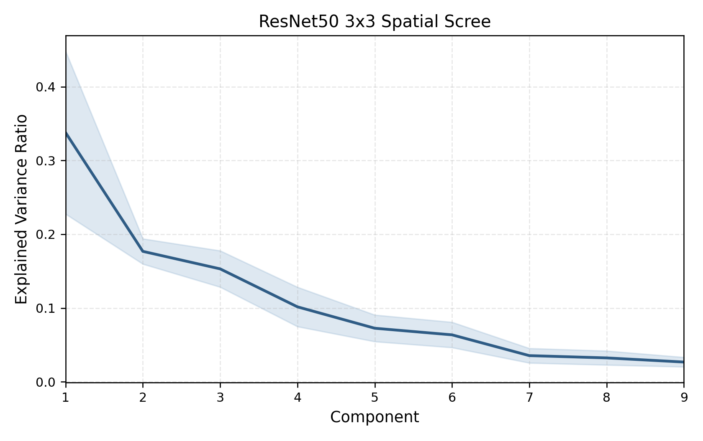

# additional_R50 Main Weight Analysis

This page summarizes the later 9-model ResNet-50 analysis that used to live under `ResNet50/` and is now renamed `additional_R50/` to separate it from the scratch ResNet-50 experiments in `CNN/`.

This is follow-up analysis. It adds:

- alpha-based layer diagnostics
- spatial-wise `3x3` factorization
- scree plots
- reconstruction summaries
- coefficient-only and coefficient-plus-head rescue at low rank

Canonical package: [`../../additional_R50`](../../additional_R50/README.md)

## Validated Snapshot

- Source family size: `9`
- Common layers: `52`
- Retained layers: `52`
- Factorized `3x3` layers: `10`
- Reconstruction mode: spatial factorization over the common family

Mean top-1 over the five evaluated targets:

| Variance threshold | UniSub mean top-1 | Delta | Savings |
| --- | --- | --- | --- |
| `0.80` | `0.7826` | `-0.0274` | `8.42%` |
| `0.90` | `0.8045` | `-0.0055` | `5.23%` |
| `0.95` | `0.8085` | `-0.0015` | `2.78%` |

Low-rank rescue remains strongest at aggressive truncation:

- coefficient tuning improves `SVHN` from `0.6373` to `0.9119` at `vt = 0.60`
- coefficient-plus-head tuning improves `SVHN` from `0.6250` to `0.9106` at `vt = 0.60`

## Visuals

| Channel scree | Spatial scree |
| --- | --- |
|  |  |

The channel scree is the nicer long-axis public-facing plot here because it keeps a large component axis; the spatial scree is retained mainly as supporting context.

## Included Artifacts

- [scratch_alpha_summary.json](./artifacts/scratch_alpha_summary.json)
- [scratch_raw_mean_summary.csv](./artifacts/scratch_raw_mean_summary.csv)
- [coefficient calibration table](./artifacts/scratch_iid_coeff_calibration.csv)
- [coefficient-plus-head calibration table](./artifacts/scratch_ood_coeff_head_calibration.csv)
- [scratch_retained_layers.csv](./artifacts/scratch_retained_layers.csv)
- [channel_mean_scree.png](./artifacts/channel_mean_scree.png)
- [spatial_mean_scree.png](./artifacts/spatial_mean_scree.png)

## Code In This Folder

This additional-analysis package includes copied run scripts so it is self-contained:

- [scripts/download_or_train_models.sh](./scripts/download_or_train_models.sh)
- [scripts/compute_alpha_metrics.sh](./scripts/compute_alpha_metrics.sh)
- [scripts/reconstruct_and_evaluate.sh](./scripts/reconstruct_and_evaluate.sh)
- [scripts/low_rank_calibration.sh](./scripts/low_rank_calibration.sh)
- [scripts/run_scratch_pipeline.sh](./scripts/run_scratch_pipeline.sh)
- [requirements_public.txt](./requirements_public.txt)

The fuller public documentation still lives in [`../../additional_R50/README.md`](../../additional_R50/README.md).
