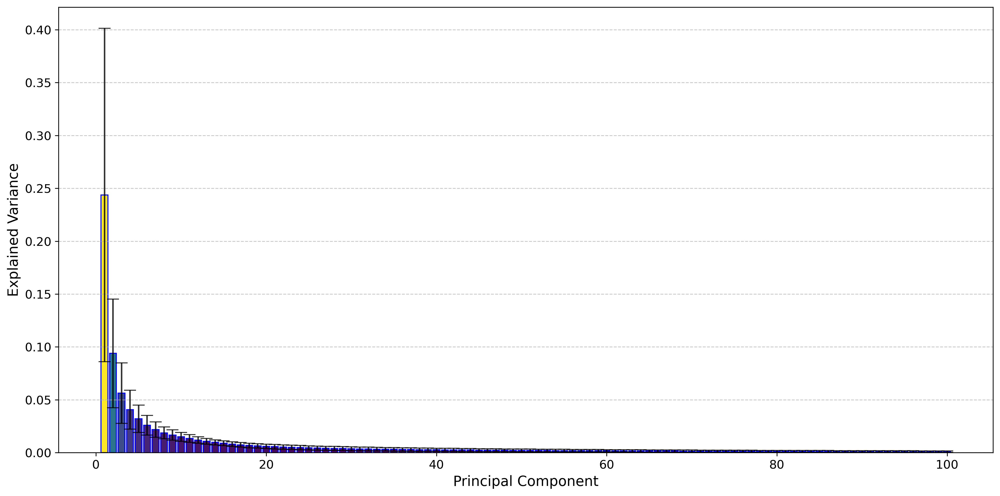

# Flan-T5 GLUE Main Weight Analysis

This folder packages the recent Flan-T5 GLUE analysis artifacts built from `google/flan-t5-large` together with the task-adapted checkpoints used in the follow-up UniSub analysis. Unlike `vit`, `gpt2`, and `llama`, this repo does not have a separate paper-era Flan-T5 experiment folder, so this page is the public entry point for that recent-analysis snapshot.

## Validated Snapshot

- Models analyzed: `196`
- Matrix-valued layers analyzed: `216`
- Retained alpha-qualified layers: `179`
- `q_all = 0.0224`
- `q_arch = 0.4850`
- Mean alpha over all values: `3.9136`

Family memory savings:

| Variance threshold | Family savings | Compression multiple |
| --- | --- | --- |
| `0.80` | `90.59%` | `10.63x` |
| `0.90` | `85.13%` | `6.72x` |
| `0.95` | `79.78%` | `4.95x` |

## Scree

This aggregate scree plot is the main public-facing summary because it shows the shared low-rank structure across the encoder and decoder layers in one place.

## Included Artifacts

- [alpha_summary.json](./artifacts/alpha_summary.json)
- [summary.json](./artifacts/summary.json)
- [aggregate_scree.png](./artifacts/aggregate_scree.png)
- [aggregate_cumulative.png](./artifacts/aggregate_cumulative.png)
- [alpha_vs_savings.png](./artifacts/alpha_vs_savings.png)
- [memory_thresholds.csv](./artifacts/memory_thresholds.csv)
- [alpha_layer_metrics.csv](./artifacts/alpha_layer_metrics.csv)
- [alpha_retained_layers.csv](./artifacts/alpha_retained_layers.csv)

These files are copied from the recent transformer-analysis workspace and committed here as the validated public snapshot for the Flan-T5 GLUE family.
