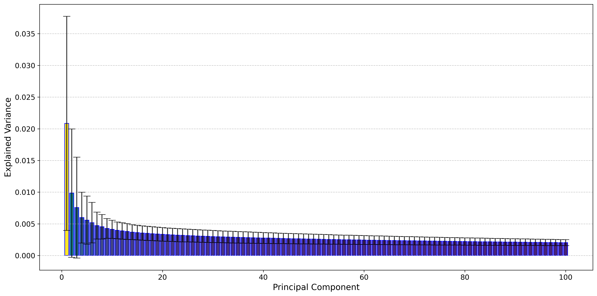

# GPT-2 Main Weight Analysis

This folder is the additional GPT-2 analysis release. It augments the original paper-era [`../../GPT2`](../../GPT2/README.md) folder with the newer alpha, scree, retained-layer, and memory-threshold outputs.

## Validated Snapshot

- Models analyzed: `177`
- Matrix-valued layers analyzed: `49`
- Retained alpha-qualified layers: `23`
- `q_all = 0.0725`
- `q_arch = 0.3059`
- Mean alpha over all values: `4.0951`

Family memory savings:

| Variance threshold | Family savings | Compression multiple |
| --- | --- | --- |
| `0.80` | `64.73%` | `2.84x` |
| `0.90` | `64.57%` | `2.82x` |
| `0.95` | `64.57%` | `2.82x` |

## Scree

[](./artifacts/aggregate_scree.png)

This aggregate scree plot is the main public-facing summary because it shows the long-tail low-rank structure across `100` principal components.

## Included Artifacts

- [alpha_summary.json](./artifacts/alpha_summary.json)
- [summary.json](./artifacts/summary.json)
- [aggregate_scree.png](./artifacts/aggregate_scree.png)
- [aggregate_cumulative.png](./artifacts/aggregate_cumulative.png)
- [alpha_vs_savings.png](./artifacts/alpha_vs_savings.png)

## Code In This Folder

The original paper-era scripts are copied into [`scripts/`](./scripts/):

- [scripts/download_models.py](./scripts/download_models.py)
- [scripts/run_pca.py](./scripts/run_pca.py)
- [scripts/generate_plots.py](./scripts/generate_plots.py)
- [scripts/gpt2.txt](./scripts/gpt2.txt)

Run path:

```bash
cd /mnt/data0/prakhar/unisub/Main_weight_analysis/gpt2

python scripts/download_models.py --model_name_file scripts/gpt2.txt --target_folder ./gpt2_models
python scripts/run_pca.py --model_directory ./gpt2_models --target_folder ./gpt2_plots
python scripts/generate_plots.py --pca_dir ./gpt2_plots/pca --output_dir ./results --plot_type both
```

The committed alpha and memory-threshold artifacts come from the broader follow-up transformer run and are included here as the validated additional-analysis snapshot.
