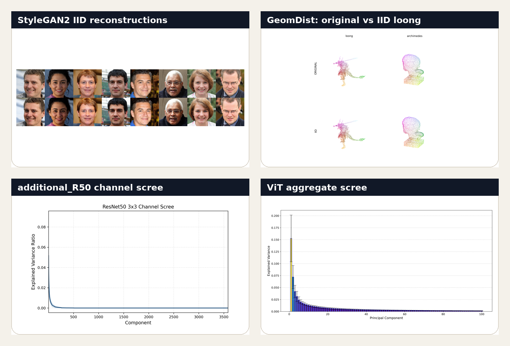
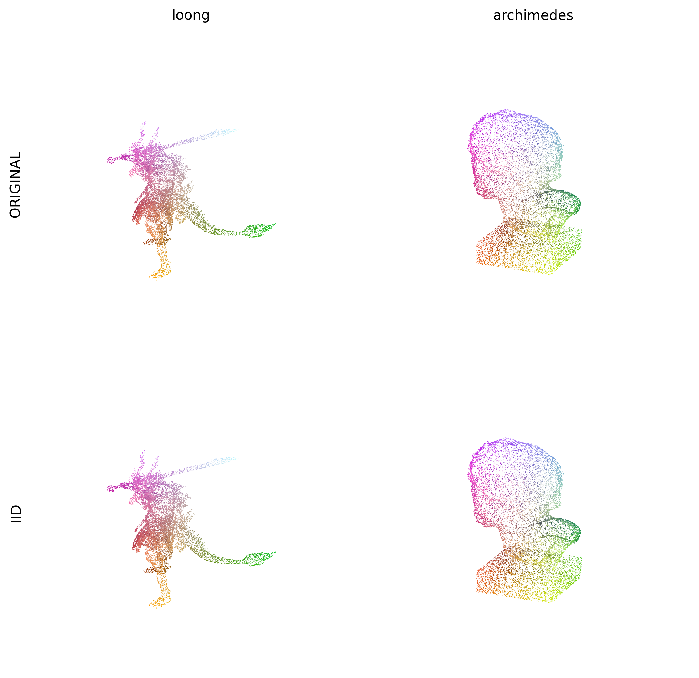
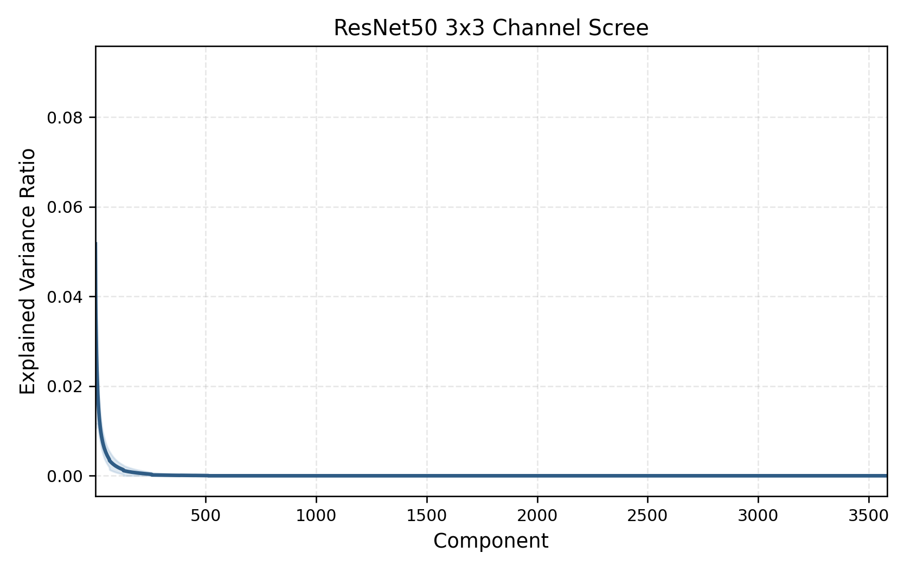
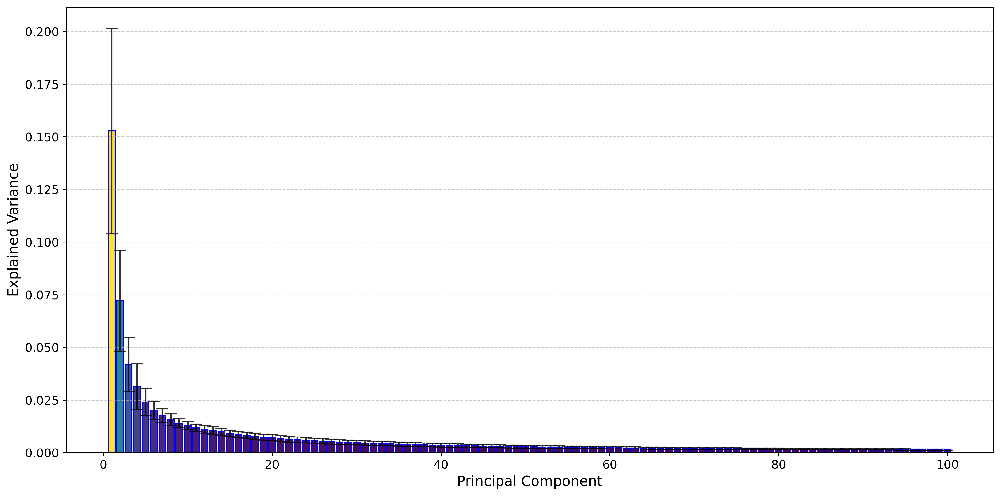

# The Universal Weight Subspace Hypothesis

<p align="center">
  <a href="https://arxiv.org/abs/2512.05117"></a>
  <a href="./assets/Universal_Subspace.pdf"></a>
</p>

This repository accompanies our paper on the Universal Weight Subspace Hypothesis.

Across independently trained models in vision, language, generative modeling, and 3D geometry, we repeatedly see the same pattern: related models cluster near a shared low-dimensional weight subspace. This repo collects the main experiments from the paper, the newer alpha-based follow-up analysis, and the clearest visual results.

## Main Figure

The one-page summary of the paper is here: [main figure (PDF)](./assets/unisub_mainfig.pdf).

For the full paper, use [arXiv](https://arxiv.org/abs/2512.05117) or the local [paper PDF](./assets/Universal_Subspace.pdf).

## A Quick Visual Tour

<p align="center">
  
</p>

## Where To Start

- [CNN](./CNN/README.md): scratch ResNet-50 experiments trained from scratch for the paper
- [VIT](./VIT/README.md): ViT weight-space analysis
- [GPT2](./GPT2/README.md): GPT-2 weight-space analysis
- [LLaMA](./LLaMA/README.md): LLaMA weight-space analysis
- [additional_R50](./additional_R50/README.md): later 9-model ResNet-50 analysis with spatial calculations, alpha analysis, scree plots, and coefficient calibration
- [Main_weight_analysis](./Main_weight_analysis/README.md): newer analysis bundle with scree plots, alpha summaries, retained-layer tables, and collected follow-up results
- [StyleGANV2](./StyleGANV2/README.md): generator reconstruction results
- [GeomDist](./GeomDist/README.md): 3D geometry reconstruction results

## Selected Results

| Experiment | What it covers | What to look at |
| --- | --- | --- |
| `CNN` | scratch ResNet-50 training and subspace reconstruction | the main ResNet-50 workflow used in the paper |
| `additional_R50` | 9 ResNet-50 models with spatial analysis and alpha filtering | mean top-1 reaches `0.8085` at `95%` explained variance, with coefficient calibration included |
| `ViT` | `464` models, `18` retained layers in the follow-up analysis | `q_all = 0.0518`, `q_arch = 0.3545`, and `76.99%` savings at `80%` explained variance |
| `GPT-2` | `177` models, `23` retained layers in the follow-up analysis | `q_all = 0.0725`, `q_arch = 0.3059`, and `64.73%` savings at `80%` explained variance |
| `LLaMA` | `50` models, `116` retained layers in the follow-up analysis | `q_all = 0.0940`, `q_arch = 0.3290`, showing the same structure at larger scale |
| `StyleGAN2` | `20` public generators, `9` retained convolution layers | the released UniSub reconstructions stay visually close to the source generators |
| `GeomDist` | retained spectral layers for neural geometry | the reconstructed `loong` shape stays faithful while still giving a useful compression gain |

## Alpha Metric

The alpha metric is the main signal we use to decide which layers are good candidates for a shared basis.

1. For each layer shared across a set of models, we collect the weight matrix, or a matrix-valued factorization when that is the right view.
2. We compute the singular-value or eigenvalue spectrum of that layer.
3. We fit a power-law tail and extract the spectral exponent `alpha`.
4. We compare those alpha values across models to see which layers behave consistently and which ones are unstable.
5. We keep the layers whose spectral structure looks most reliable, and build the UniSub basis from that subset.

Why it is useful:

- It gives us an unsupervised way to score layer quality directly from weights.
- It transfers well across CNNs, transformers, generators, and 3D models.
- It helps separate layers that genuinely share structure from layers that are too noisy or too model-specific.
- It leads to a cleaner universal basis than treating every layer as equally useful.

## Visual Highlights

| Geometry | Generative modeling |
| --- | --- |
| [](./GeomDist/README.md) | [](./StyleGANV2/README.md) |

| additional_R50 scree | ViT scree |
| --- | --- |
| [](./Main_weight_analysis/additional_R50/README.md) | [](./Main_weight_analysis/vit/README.md) |

## 3D Viewer

The `loong` point cloud can be explored directly in the browser:

- [Interactive 3D viewer](./index.html)
- [Viewer implementation](./docs/loong_viewer.html)
- [Original PLY](./assets/showcase/original_loong_sample.ply)
- [UniSub reconstruction PLY](./assets/showcase/iid_loong_sample.ply)

## Main Weight Analysis

[Main_weight_analysis](./Main_weight_analysis/README.md) collects the newer follow-up analysis that sits alongside the main experiment directories.

It currently includes:

- [additional_R50](./Main_weight_analysis/additional_R50/README.md)
- [ViT analysis](./Main_weight_analysis/vit/README.md)
- [GPT-2 analysis](./Main_weight_analysis/gpt2/README.md)
- [LLaMA analysis](./Main_weight_analysis/llama/README.md)
- [analysis notes](./Main_weight_analysis/analysis_readme.md)
- [cross-model summary CSV](./Main_weight_analysis/family_summary.csv)

Important code note:

- For `vit`, `gpt2`, and `llama`, this directory combines released follow-up artifacts with copies of the base download/PCA/plot scripts from this repo.
- It is not a verbatim mirror of the separate transformer analysis workspace.
- Coefficient calibration is currently included for `additional_R50`.

## Related Projects

- [EigenLoRA](https://github.com/toshi2k2/EigenLoRA/): PEFT training built around UniSub-style shared eigenspaces
- [SHARE](https://github.com/ankit-vaidya19/Share): UniSub-inspired work on continual learning

## TODO

- Model merging experiments on top of the retained UniSub bases
- A Python library that extracts a universal subspace from a directory of checkpoints together with their alpha values
- Layerwise interactive controls for alpha thresholds, retained layers, and explained-variance targets
- Hosted checkpoint bundles for the larger model collections
- More releases once the reconstructions are ready to show cleanly

## Citation

```bibtex
@article{kaushik2025universal,
  title={The Universal Weight Subspace Hypothesis},
  author={Kaushik, Prakhar and Chaudhari, Shravan and Vaidya, Ankit and Chellappa, Rama and Yuille, Alan},
  journal={arXiv preprint arXiv:2512.05117},
  year={2025}
}
```
