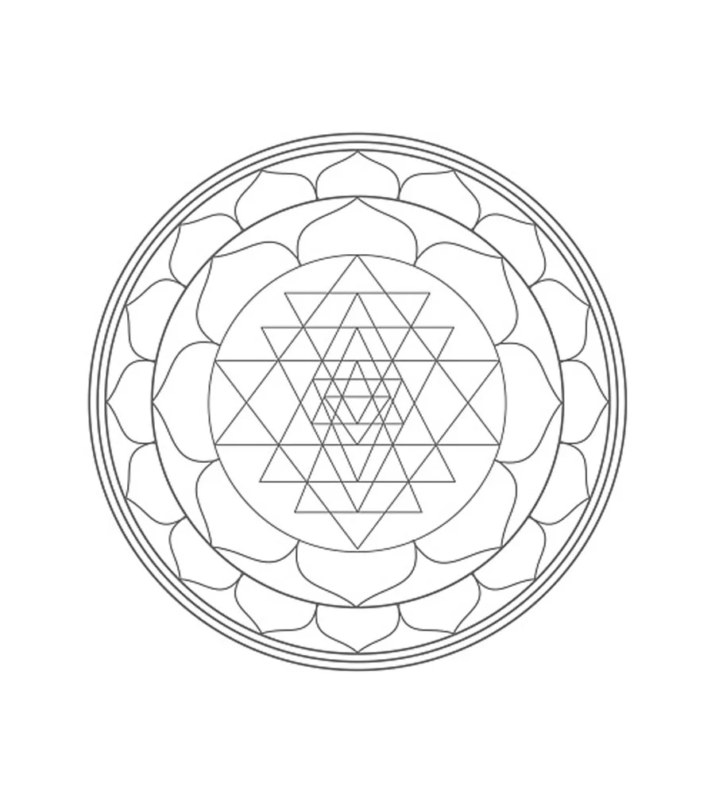
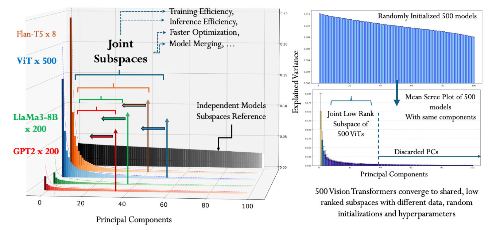

#  The Universal Weight Subspace Hypothesis

<p align="center">
  <a href="https://arxiv.org/abs/2512.05117"></a>
  <a href="./assets/Universal_Subspace.pdf"></a>
</p>

<p align="center"><strong>Prakhar Kaushik, Shravan Chaudhari, Ankit Vaidya, Rama Chellappa, Alan Yuille</strong></p>

<p align="center"><em>Independently trained models keep returning to the same low-dimensional region in weight space.</em></p>

<p align="center">
  <a href="./assets/unisub_mainfig.pdf">
    
  </a>
</p>

This is the official repository for the Universal Weight Subspace Hypothesis paper.

**Universal Weight Subspace Hypothesis:** Backpropagated neural networks - despite being trained on diverse, potentially disjoint datasets with varying hyperparameters, initializations, and regularization techniques - systematically converge to learn architecture-specific, layer-wise low-rank joint subspaces, which we term the *Universal Subspace*.

For the full paper, use [arXiv](https://arxiv.org/abs/2512.05117) or the local [paper PDF](./assets/Universal_Subspace.pdf).

## Application Examples

<p align="center">
  
</p>

## Repo Structure


| Experiments | Location |
| --- | --- |
| ViT analysis | [VIT](./VIT/README.md) |
| GPT-2 analysis | [GPT2](./GPT2/README.md) |
| LLaMA analysis | [LLaMA](./LLaMA/README.md) |
| ResNet-50 experiments | [CNN](./CNN/README.md) |
| additional ResNet-50 (+alpha) analysis | [additional_R50](./additional_R50/README.md) |
| additional ViT, GPT-2, and LLaMA analysis | [Main_weight_analysis](./Main_weight_analysis/README.md) |
| Mistral LoRA / generation experiments | [NLG](./NLG/README.md) |
| GLUE / RoBERTa adapter experiments | [NLU](./NLU/README.md) |
| ViT adapter image classification | [ImageClassification](./ImageClassification/README.md) |
| SDXL style LoRAs | [Diffusion](./Diffusion/README.md) |
| image generation (StyleGAN2) | [StyleGANV2](./StyleGANV2/README.md) |
| 3D reconstruction (Geometric Distribution) | [GeomDist](./GeomDist/README.md) |

<!-- ## What Is In This Repo

| Core experiments | Extended analysis | Visual demos |
| --- | --- | --- |
| `CNN`, `VIT`, `GPT2`, and `LLaMA` hold the main experiment code and basic PCA workflows. | `Main_weight_analysis` and `additional_R50` collect the newer alpha-based analysis, scree plots, retained-layer summaries, and calibration results. | `StyleGANV2`, `GeomDist`, and the interactive PLY viewer show the cleanest reconstructions and qualitative comparisons. | -->

## Adapter And LoRA Experiments

Low Rank Adapter-based results are also a major part of the paper and they are included directly in this repo.

| Experiment/Task | What it covers | Location |
| --- | --- | --- |
| `NLG` | Mistral LoRA reconstruction and SubspaceAdapter evaluation across generation tasks, with ROUGE-L scoring | [NLG](./NLG/README.md) |
| `NLU` | RoBERTa on GLUE with LoRA, HOSVD, and SubspaceAdapter initialization | [NLU](./NLU/README.md) |
| `ImageClassification` | ViT image classification with LoRA, VeRA, and SubspaceAdapter | [ImageClassification](./ImageClassification/README.md) |
| `Diffusion` | SDXL style LoRAs, reconstructed adapters, and SubspaceAdapter outputs for image generation | [Diffusion](./Diffusion/README.md) |
| `diffusers` | Local diffusion adapter plumbing for PEFT and SubspaceAdapter state dicts and loaders | [diffusers](./diffusers/README.md) |

For a cleaner dedicated PEFT codebase and further implementation details, refer to [EigenLoRA](https://github.com/toshi2k2/EigenLoRA/).

## Representative Results

| Experiment | What it covers | What to look at |
| --- | --- | --- |
| `CNN` | scratch ResNet-50 training and subspace reconstruction | the main ResNet-50 workflow used in the paper |
| `additional_R50` | 9 ResNet-50 models with spatial analysis and alpha filtering | mean top-1 reaches `0.8085` at `95%` explained variance, with coefficient calibration included |
| `ViT` | `464` models, `18` retained layers in the extended analysis | `q_all = 0.0518`, `q_arch = 0.3545`, and `76.99%` savings at `80%` explained variance |
| `GPT-2` | `177` models, `23` retained layers in the extended analysis | `q_all = 0.0725`, `q_arch = 0.3059`, and `64.73%` savings at `80%` explained variance |
| `LLaMA` | `50` models, `116` retained layers in the extended analysis | `q_all = 0.0940`, `q_arch = 0.3290`, showing the same structure at larger scale |
| `Flan-T5 GLUE` | `196` task-adapted checkpoints in the recent analysis release | `q_all = 0.0224`, `q_arch = 0.4850`, and `85.13%` savings at `90%` explained variance |
| `StyleGAN2` | `20` public generators, `9` retained convolution layers | the released UniSub reconstructions stay visually close to the source generators |
| `GeomDist` | retained spectral layers for neural geometry | the reconstructed `loong` shape stays faithful while still giving a useful compression gain |

## Alpha Metric

The alpha metric is the layer-selection score we use to decide which parts of an architecture are good candidates for a shared UniSub basis.

For each corresponding layer `l` across a model family, we estimate one power-law exponent `alpha_(m,l)` per model `m` using a WeightWatcher-style fit to the tail of that layer's eigenvalue spectrum. The key idea is simple: if a layer keeps landing in the same well-behaved spectral regime across independently trained models, it is a much better candidate for a shared basis than a layer whose spectrum is erratic from model to model.

Let

$$
A_l = \{\alpha_{m,l}\}_{m=1}^{N_l}
$$

be the finite alpha values for layer `l`, where `N_l` is the number of valid models for that layer. We first compute the basic summary statistics

$$
\mu_l = \frac{1}{N_l}\sum_{m=1}^{N_l}\alpha_{m,l}, \qquad
\sigma_l = \sqrt{\frac{1}{N_l}\sum_{m=1}^{N_l}(\alpha_{m,l}-\mu_l)^2},
$$

and the fraction of models whose alpha lies in the preferred range

$$
f_l = \frac{1}{N_l}\sum_{m=1}^{N_l}\mathbf{1}[\,\alpha_{\min} \le \alpha_{m,l} \le \alpha_{\max}\,].
$$

In the current pipeline we use `alpha_min = 2`, `alpha_max = 6`, which is the band we treat as the most reliable spectral regime.

For each individual alpha value, the code defines an in-range quality term

$$
\phi(\alpha)=
\begin{cases}
\exp\!\left(-\eta(\alpha-\alpha_{\min})\right), & \alpha_{\min} \le \alpha \le \alpha_{\max}, \\
0, & \text{otherwise},
\end{cases}
$$

with `eta = 0.5`. A layer receives a high score only if it has enough evidence, enough in-range alphas, and low dispersion across models:

$$
q_l =
\left(1 - e^{-N_l/\kappa}\right)
\left(\frac{1}{N_l}\sum_{\alpha \in A_l}\phi(\alpha)\right)
e^{-\lambda \sigma_l},
$$

with `kappa = 20`, `lambda = 1`, and `q_l` clipped to `[0, 1]`.

Each factor has a clear role:

- `1 - exp(-N_l / kappa)` is an evidence term. It prevents a layer from looking artificially strong when only a handful of checkpoints are available.
- `mean(phi(alpha))` rewards layers whose alphas stay inside the preferred band and are closer to the lower end of that band.
- `exp(-lambda * sigma_l)` penalizes layers whose alpha values vary too much across models.

Before applying `q_l`, we also use a coarse statistical filter:

$$
\mu_l \in [2, 6], \qquad \sigma_l \le 1, \qquad f_l \ge 0.5.
$$

A layer is retained only if it passes that coarse filter and also satisfies

$$
q_l \ge 0.2.
$$

The family-level summaries reported in this repo are geometric means of the per-layer scores:

$$
q_{\mathrm{all}} = \exp\!\left(\frac{1}{L}\sum_{l=1}^{L}\log(\max(q_l,\varepsilon))\right),
$$

over all analyzed layers, and

$$
q_{\mathrm{arch}} = \exp\!\left(\frac{1}{|\mathcal{R}|}\sum_{l \in \mathcal{R}}\log(\max(q_l,\varepsilon))\right),
$$

over the retained layer set `R`, with `eps = 1e-12` used only for numerical stability.

This is why the alpha metric is useful for UniSub. It is a weights-only criterion that looks for layers that are common, stable, and spectrally consistent across many independently trained models. Those are exactly the layers where a shared low-dimensional basis is most likely to be meaningful. While we do run Universal Subspace analysis for non-ideal layers as well, for analysis - this metric will give an idea of how useful your extracted Universal Subspace for an architecture or even a layer is, since extracting a Universal Subspace from noisy or poorly train models will lead to a bad approximation.


## Visual Examples

| 3D Geometry Generation | Generative modeling |
| --- | --- |
| [](./GeomDist/README.md) | [](./StyleGANV2/README.md) |

| additional_R50 scree | ViT scree |
| --- | --- |
| [](./Main_weight_analysis/additional_R50/README.md) | [](./Main_weight_analysis/vit/README.md) |

## 3D Viewer

The `loong` point cloud can be explored directly in the browser. This is a real interactive comparison, not a static screenshot:

- [Interactive 3D viewer](./index.html)
- [Viewer implementation](./docs/loong_viewer.html)
- [Original PLY](./assets/showcase/original_loong_sample.ply)
- [UniSub reconstruction PLY](./assets/showcase/iid_loong_sample.ply)

## Extended Weight Analysis

[Main_weight_analysis](./Main_weight_analysis/README.md) packages the extra analysis we ran on top of the main experiment directories.

It currently includes:

- [additional_R50](./Main_weight_analysis/additional_R50/README.md)
- [ViT analysis](./Main_weight_analysis/vit/README.md)
- [GPT-2 analysis](./Main_weight_analysis/gpt2/README.md)
- [LLaMA analysis](./Main_weight_analysis/llama/README.md)
- [Flan-T5 GLUE analysis](./Main_weight_analysis/flan_t5_glue/README.md)
- [analysis notes](./Main_weight_analysis/analysis_readme.md)
- [cross-model summary CSV](./Main_weight_analysis/family_summary.csv)

Important code note:

- For `vit`, `gpt2`, and `llama`, this directory combines released analysis artifacts with copies of the base download/PCA/plot scripts from this repo.
- `flan_t5_glue` is currently an artifact-backed release page rather than a duplicated script package.
- It is not a verbatim mirror of the separate transformer analysis workspace.
- Coefficient calibration is currently included for `additional_R50`.

## Related Projects

- [EigenLoRA](https://github.com/toshi2k2/EigenLoRA/): PEFT training built around UniSub-style shared eigenspaces
- [SHARE](https://github.com/ankit-vaidya19/Share): UniSub-inspired work on continual learning

## TODO

- Model merging experiments on top of the retained UniSub bases
- A Python library that extracts a universal subspace from a directory of checkpoints together with their alpha values
- Layerwise interactive controls for alpha thresholds, retained layers, and explained-variance targets
- Hosted checkpoint bundles for the larger model collections
- More releases once the reconstructions are ready to show cleanly

## Citation

```bibtex
@misc{kaushik2025universalweightsubspacehypothesis,
      title={The Universal Weight Subspace Hypothesis}, 
      author={Prakhar Kaushik and Shravan Chaudhari and Ankit Vaidya and Rama Chellappa and Alan Yuille},
      year={2025},
      eprint={2512.05117},
      archivePrefix={arXiv},
      primaryClass={cs.LG},
      url={https://arxiv.org/abs/2512.05117}, 
}
```
